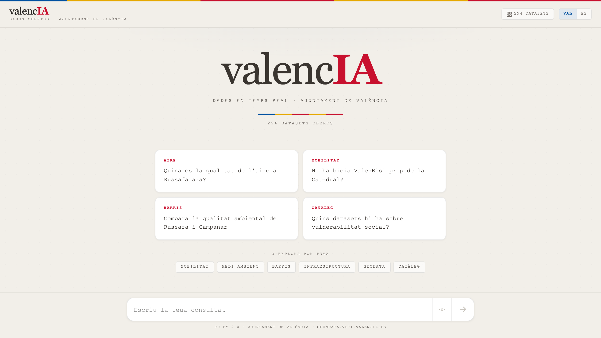
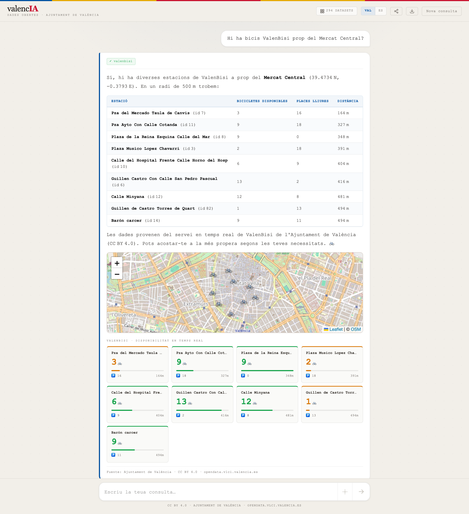
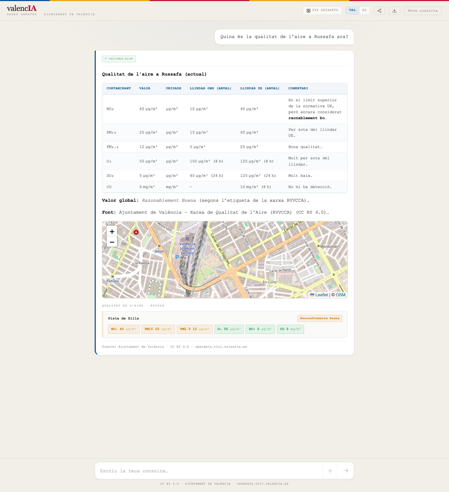

# valencIA

[](https://www.npmjs.com/package/valencia-opendata)
[](LICENSE)
[](https://creativecommons.org/licenses/by/4.0/)

**Pregunta a los datos abiertos del Ayuntamiento de València en lenguaje natural — en español o valenciano, sin instalar nada.**

→ **Probarlo ya:** [valencia-mcp.vercel.app](https://valencia-mcp.vercel.app) · sin registro, sin coste

<!-- HERO -->


---

## Qué es valencIA

Dos formas de usarlo, según lo que necesites:

### 1. Un **chatbot web** abierto a cualquiera

Entra en [valencia-mcp.vercel.app](https://valencia-mcp.vercel.app) y pregunta. No hace falta registrarse, no hace falta instalar nada, no hace falta saber qué es una API.

| Movilidad — ValenBisi cerca del Mercat Central | Calidad del aire en Russafa |
|---|---|
|  |  |

Cada respuesta incluye los datos en bruto, un mapa interactivo cuando aplica, cards visuales con los valores clave y la atribución `Ajuntament de València · CC BY 4.0` con la URL exacta de la fuente.

### 2. Un **motor MCP** que conectas a tu IA preferida

Si usas Claude Desktop, Cursor, Continue o cualquier cliente que implemente [Model Context Protocol](https://modelcontextprotocol.io), puedes integrar valencIA en menos de un minuto y consultar los datos de València directamente desde tus propias conversaciones.

```sh
npx -y valencia-opendata
```

Las instrucciones por cliente están más abajo en [Integrarlo en tu IA](#integrarlo-en-tu-ia).

---

## Por qué datos abiertos

valencIA nació del convencimiento de que los datos públicos de una ciudad solo alcanzan su potencial cuando cualquier ciudadano puede acceder a ellos en lenguaje natural, sin conocimientos técnicos.

El Ayuntamiento de València publica más de 290 datasets bajo licencia **CC BY 4.0** en su portal CKAN y su Geoportal ArcGIS. La barrera no es la falta de datos: es la distancia entre un archivo JSON o una capa GIS y la pregunta cotidiana de alguien que quiere saber si hay bicis ValenBisi cerca o cómo está el aire en su barrio.

valencIA elimina esa distancia conectando el portal municipal directamente a la inteligencia de un modelo de lenguaje. La IA no inventa: invoca una tool, obtiene el dato en tiempo real de la fuente oficial y lo explica con contexto. Cada respuesta incluye la URL exacta de origen y la atribución CC BY 4.0.

**Solo se consumen fuentes oficiales.** CKAN `opendata.vlci.valencia.es` y Geoportal `geoportal.valencia.es`. No se scrapea ninguna web municipal. Eso garantiza la trazabilidad jurídica y el cumplimiento de la licencia abierta.

---

## Qué puede responder

Ejemplos reales que el sistema resuelve invocando una o varias tools:

**Calidad del aire**
- "¿Qué calidad del aire hay ahora en Russafa?"
- "Dame el NO₂ de la estación Centro y compáralo con el límite de la OMS."
- "¿Cuál es la estación de aire más cercana a la Universidad Politécnica?"

**Movilidad — ValenBisi · EMT · tráfico**
- "¿Cuántos ValenBisi libres hay cerca de la Plaça de l'Ajuntament?"
- "¿Qué buses pasan por la parada 2105? ¿Y cerca de la Estación del Norte?"
- "Estado del tráfico ahora mismo en el centro: tramos, intensidad y cámaras."

**Barrios y pulso ambiental**
- "Dime todo lo que sepas del barri Russafa: distrito, área, polígono."
- "Compara el pulso ambiental de Russafa vs Ciutat Vella."
- "¿Qué espacios verdes hay en El Carme y cuántos m² suman?"

**Descubrimiento del catálogo**
- "¿Hay datos abiertos sobre Fallas? ¿Y sobre vivienda pública?"
- "Lista los datasets de movilidad y dame los formatos de cada uno."
- "Capas ArcGIS disponibles en `OPENDATA/Trafico`."

---

## Integrarlo en tu IA

valencIA implementa el estándar abierto **Model Context Protocol (MCP)**. Cualquier cliente compatible puede consumirlo.

### Instalación

**Opción A — npx (sin instalación):**
```sh
npx -y valencia-opendata
```

**Opción B — global:**
```sh
npm install -g valencia-opendata
valencia-opendata
```

**Opción C — desde el código fuente:**
```sh
git clone https://github.com/iMark21/valencia-opendata.git
cd valencia-opendata
npm install && npm run build
node dist/server.js
```

### Configuración por cliente

#### Claude Desktop

Edita `~/Library/Application Support/Claude/claude_desktop_config.json` (macOS) o el equivalente en Windows/Linux:

```json
{
  "mcpServers": {
    "valencia": {
      "command": "npx",
      "args": ["-y", "valencia-opendata"]
    }
  }
}
```

Reinicia Claude Desktop con **Cmd+Q** y reábrelo. Aparecerá `valencia` en la barra de herramientas.

#### Cursor

`~/.cursor/mcp.json` (o desde `Settings → MCP`):

```json
{
  "mcpServers": {
    "valencia": {
      "command": "npx",
      "args": ["-y", "valencia-opendata"]
    }
  }
}
```

#### Continue.dev / VS Code

En `~/.continue/config.json`, dentro de `experimental.modelContextProtocolServers`:

```json
{
  "transport": {
    "type": "stdio",
    "command": "npx",
    "args": ["-y", "valencia-opendata"]
  }
}
```

#### Cualquier cliente MCP por stdio

- **command:** `npx`
- **args:** `["-y", "valencia-opendata"]`

---

## Las 12 tools

| Tool | Qué resuelve | Fuente |
|------|--------------|--------|
| `list_datasets` | Catálogo CKAN con filtros (tema, formato, organización) | CKAN |
| `get_dataset` | Metadata + recursos + capas ArcGIS relacionadas | CKAN |
| `get_dataset_resource` | URL + esquema + frescura (sin descargar bytes) | CKAN |
| `full_text_search` | Búsqueda full-text puntuada sobre los 294 datasets | CKAN |
| `find_geo_layers` | Descubrimiento de servicios y capas del Geoportal | Geoportal |
| `query_geo_layer` | Query sobre cualquier capa del Geoportal | Geoportal |
| `get_air_quality` | NO₂/PM10/PM2.5/O₃ en tiempo real, 11 estaciones RVVCCA | Geoportal |
| `get_valenbisi_availability` | Bicis y muelles libres por estación, filtro por proximidad | Geoportal |
| `get_traffic_state` | Tramos, intensidad y cámaras de tráfico | Geoportal |
| `get_neighborhood_info` | Geometría, distrito, área y vulnerabilidad del barrio | Geoportal + CKAN |
| `get_neighborhood_pulse` | Puntuación 0-100 compuesta (aire + verde + ruido + vulnerabilidad) | Multicapa |
| `get_emt_stops` | Paradas EMT con líneas y URL de próximas llegadas | Geoportal |

Cada respuesta incluye `attribution` y la URL exacta de la fuente.

---

## Para desarrolladores

```sh
npm test               # vitest, replay sin red, ~1.3 s, 142 tests
npm run record         # regraba fixtures contra los portales live
npm run typecheck
npm run lint
npm run cli -- tools                                        # lista las 12 tools
npm run cli -- call get_air_quality '{"station":"centre"}'
```

Los tests funcionan en modo **record/replay**: `npm test` lee fixtures versionados (`tests/fixtures/`) y no toca la red. `npm run record` regraba contra los portales live cuando algo cambia upstream.

### Requisitos

- Node.js ≥ 20
- Sin API keys — el portal municipal no requiere autenticación

### Invariantes de diseño

- **Live only.** Cada tool resuelve a una llamada upstream. Sin base de datos, sin snapshots.
- **In-memory cache.** TTLs cortos (30 s a 1 h). El cache muere con el proceso.
- **Pointer, no bytes.** Para datos pesados (CSVs históricos, GTFS) la tool devuelve URL + tamaño + frescura. El cliente decide si descarga.
- **Solo CKAN + Geoportal.** CC BY 4.0 declarada en ambas fuentes.

### Accesibilidad (chatbot web)

La interfaz cumple **WCAG 2.1 nivel AA**: foco visible, ARIA semántico, contraste corregido, soporte de teclado completo, sincronización del atributo `lang` con el idioma seleccionado y respeto a `prefers-reduced-motion`.

---

## Licencia y atribución

Código: MIT License — © 2026 Michel Marques

Datos: **Ajuntament de València · CC BY 4.0**
- Portal CKAN: [opendata.vlci.valencia.es](https://opendata.vlci.valencia.es)
- Geoportal ArcGIS: [geoportal.valencia.es](https://geoportal.valencia.es)
